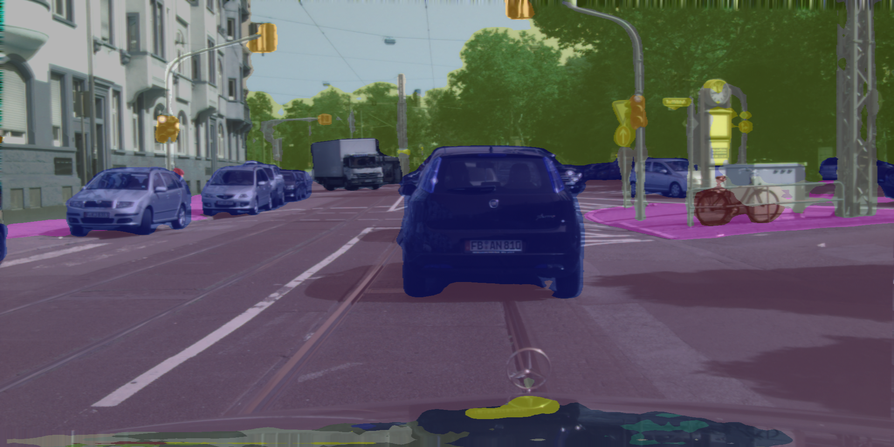

# PIDNet.TensorRT
TensorRT project of [PIDNet](https://github.com/XuJiacong/PIDNet)

[中文说明](READMECH.md)

### 1. export weights as *.wts

see custom.py. put custom.py into the pytorch project `tools/`, set `--w` to be `True`:

```
python tools/custom.py
```



to test png images and export weights as `PIDNet.wts`.

#### 2. check TensorRT path in CMakeList.txt and wts path in pidnet.cpp

#### 3. Convert wts to TensorRT engine

```
mkdir build
cd build
cmake ..
make -j8
./main -s
```

run above and convert trt engine `PIDNetS.engine`.

#### 4. Demo

put *.png images into folder samples and run:

```
./main -d samples
```


#### ToDo

- [x] cuda preprocess

- [x] PIDNet-S

- [ ] PIDNet-M/L...

  

